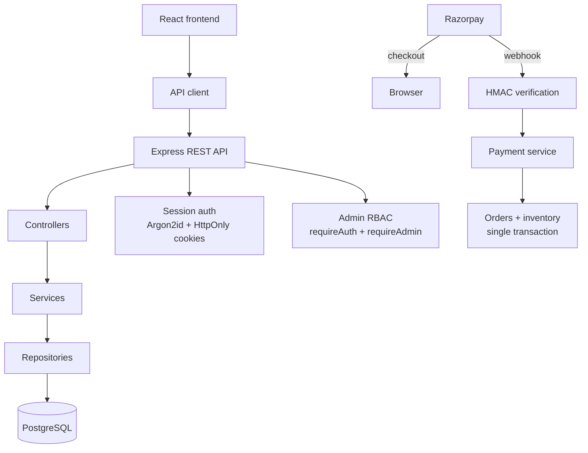

# ToyBox

A full-stack e-commerce platform for a toy storefront — built as an evolving software-engineering project covering commerce, payments, authentication, operations, testing, and production engineering.


## What this is

ToyBox started as a React storefront and grew into a complete commerce platform: a layered Express + PostgreSQL backend, real customer accounts, a test-mode Razorpay payment lifecycle with webhooks, an admin dashboard for day-to-day operations, and a large automated test suite that runs the whole stack end-to-end.

Every phase was built to exercise a real engineering concern — server-authoritative pricing, transactional inventory, session security, idempotent payment handling, audit trails — rather than to demo UI alone. The repository is the record of that evolution: 23 design documents and 5 architecture decision records sit next to the code.

> **Status:** feature-complete through the admin/operations phase and production-engineered for staging. **Not deployed** to a live environment, and Razorpay runs on **test-mode credentials** — no real charges occur. See [Current status](#current-status--roadmap).

## Features

### Storefront

- Catalog of 54 products across 52 categories and 53 brands, served from PostgreSQL
- Search, category / brand / price / rating / in-stock filtering, five sort options, pagination
- Product detail pages with quick-view modal, recently-viewed history, wishlist
- URL-addressable browsing state (`?category=`, `?brand=`, `?sort=`, `?q=`) — filters survive refresh and sharing
- Dark / light theme with OS-preference detection, toast notifications, route-aware breadcrumbs
- Fully responsive layout with Framer Motion transitions

### Commerce

- Cart drawer + full cart page, quantity management, subtotal tracking
- Multi-step checkout (**Shipping → Payment → Review → Confirmation**) with step guards that block skipping ahead
- **Server-authoritative pricing**: totals are recalculated from current database prices at order time — client values are never trusted
- Transactional order creation: order, line items, and stock decrement commit in one database transaction with row-level locks for concurrency safety
- Collision-safe order numbers (`TBX-YYYYMMDD-XXXXXX`)
- Order history, order details, reorder support
- Cart-changed protection, empty-cart guards, duplicate-submission guard
- Inventory validation at every step — overselling returns a structured error

### Payments

- **Razorpay Standard Checkout** integration (test mode): card, UPI, netbanking via Razorpay's hosted flow
- Cash on Delivery as a first-class alternative path
- Server-side payment order creation with amount/currency verification against the order total
- **Signature verification** of the checkout response before a payment is marked verified
- **Webhook confirmation** (`POST /api/webhooks/razorpay`) with HMAC signature verification middleware
- Idempotent webhook handling — duplicate deliveries cannot double-apply state transitions
- Full payment lifecycle persisted (`created → authorized → captured / failed`), surfaced in order details and the admin panel
- Card data never touches the database — only provider references and safe metadata

### Accounts

- Registration and login with **Argon2id** password hashing
- Opaque session tokens in **HttpOnly + SameSite cookies** (Secure in production) — nothing sensitive in localStorage
- Session rotation on refresh (session-fixation protection), logout, and "log out everywhere"
- Password change and email-based password reset (one-time token stored only as a hash, 30-minute TTL; console/file transport in dev, real SMTP in production)
- Saved addresses with default selection; orders snapshot the address at purchase time
- Guest → account migration: anonymous carts and wishlists merge into the account on register/login; same-browser guest orders are claimed
- Ownership is derived server-side — cross-user access to carts, wishlists, or orders returns 404/401
- Account-enumeration protection (generic auth errors), rate-limited auth endpoints, same-origin CSRF defense-in-depth

### Administration

- Admin dashboard with KPIs computed by SQL aggregation: revenue (captured), orders, customers, active products, low-stock count, pending payments
- Product management: create, edit, activate/deactivate, soft delete — with search, filters, pagination
- Category and brand management with referential-integrity guards (can't delete what products reference)
- Inventory operations: stock adjustments written atomically to an `inventory_transactions` ledger, row-locked, refusing negative stock, with mandatory reason codes
- Order management: filtered list, detail view, validated status transitions (`pending → confirmed → paid → shipped → delivered`, cancellation rules enforced)
- Customer management: search, detail, suspend/reactivate
- Payment visibility: filterable list and detail views over the payments ledger
- **Audit logging**: every admin mutation records actor, action, entity, change payload, IP, and user agent to `admin_audit_logs`
- Role-based access control enforced server-side (`requireAuth` + `requireAdmin` + dedicated rate-limit budget); the `/admin` UI is additionally guarded client-side

## Engineering highlights

- **Layered backend** — routes → controllers → services → repositories → PostgreSQL, with zod validation schemas at the boundary and centralized error envelopes
- **Server-authoritative business logic** — pricing, stock, order numbers, and ownership are decided by the API, never the browser
- **Transactional inventory** — orders and stock movements commit atomically; concurrent checkouts serialize on row locks
- **Real authentication** — Argon2id, hash-stored revocable sessions, rotation, and server-derived ownership instead of trust-the-client patterns
- **Payment integrity** — amount verification, response-signature checks, HMAC-verified webhooks, idempotent state transitions, and a dedicated payments ledger
- **Auditability** — append-only admin audit trail with actor, diff, IP, and user agent
- **Deterministic migrations & seed** — nine ordered SQL migrations with tracking; idempotent catalog seed
- **Zero-infra developer experience** — the server manages an embedded PostgreSQL 18 instance for dev/test; set `DATABASE_URL` to target an external database instead
- **Test pyramid** — ~370 frontend unit/component tests (Vitest + Testing Library + jest-axe), 150+ backend API tests (supertest against an isolated database), and 60+ full-stack Playwright E2E tests running browser → React → Express → PostgreSQL, including accessibility scans
- **CI** — GitHub Actions runs lint, unit, coverage (thresholds enforced), builds, backend suite, the full E2E suite, Docker image builds, and a report-only `npm audit`
- **Containerized** — multi-stage `Dockerfile.web` (nginx SPA + `/api` proxy) and `Dockerfile.server` (non-root, production deps only), plus a production-like compose stack with the database kept off the host network
- **Fail-safe configuration** — the server refuses to boot in production without external database, explicit CORS origins, secure cookies, Razorpay credentials, and SMTP; see `validateProductionConfig`

### Architecture

```
Customer / Admin browser
        ↓
React 19 + TypeScript (pages → hooks → services)
        ↓
API client (lib/api — typed fetch wrapper)
        ↓
Express REST API  ── helmet · CORS · rate limiting · zod validation
        ↓
Controllers → Services → Repositories
        ↓
PostgreSQL 18 (migrations + deterministic seed)

Payments:
Razorpay Checkout ⇄ browser
        ↓ webhook (HMAC-verified)
Payment service → orders / inventory (transactional)
```



## Tech stack

| Area | Choice |
| --- | --- |
| Frontend | React 19, TypeScript (strict), Vite 8, Tailwind CSS v4, Framer Motion, React Router v7 |
| Backend | Express 5, TypeScript, zod, helmet, express-rate-limit |
| Database | PostgreSQL 18 (embedded for dev/test, `DATABASE_URL` for external) |
| Auth | Argon2id password hashing, opaque cookie sessions, one-time reset tokens |
| Payments | Razorpay Standard Checkout (test mode) + COD |
| Email | Nodemailer (console / file-outbox / SMTP transports) |
| Unit/API tests | Vitest, Testing Library, jest-axe, supertest, @vitest/coverage-v8 |
| E2E | Playwright (Chromium) against the real full stack |
| CI | GitHub Actions (lint · unit · coverage · build · backend · E2E · Docker · audit) |
| Containers | Docker (nginx SPA image + API image), docker compose |

## Getting started

Prerequisites: **Node.js 22+** and npm. No Docker or PostgreSQL installation required for development — the backend manages its own embedded PostgreSQL.

```bash
npm install

# terminal 1 — API on :4000 (starts embedded PG, migrates, seeds)
npm run server:dev

# terminal 2 — Vite dev server on :5173
npm run dev
```

Open http://localhost:5173. The catalog loads from the API; placing an order exercises the real backend.

### Environment variables

Both apps read optional `.env` files. Templates with variable names and placeholder values only:

- [`.env.example`](.env.example) — frontend (`VITE_API_BASE_URL`)
- [`server/.env.example`](server/.env.example) — API (database, sessions, rate limits, Razorpay, email)
- [`.env.production.example`](.env.production.example) — production requirements (the server validates these at boot)

To enable the Razorpay checkout flow locally, copy your **test-mode** keys (`rzp_test_…`) from the Razorpay dashboard into `server/.env`. Without them the app still works end-to-end with Cash on Delivery; card/UPI payment routes simply aren't registered.

### Scripts

| Command | What it does |
| --- | --- |
| `npm run dev` / `npm run server:dev` | Frontend / backend dev servers |
| `npm run build` / `npm run server:build` | Production builds (typecheck included) |
| `npm run lint` / `npm run server:lint` | ESLint / backend typecheck |
| `npm test` / `npm run server:test` | Frontend unit suite / backend API suite (real PostgreSQL) |
| `npm run test:coverage` | Frontend suite with enforced coverage thresholds |
| `npm run test:e2e` | Full-stack Playwright suite (boots API + DB + built frontend) |
| `npm run verify` | Fast pre-commit gate: lint + unit + build |
| `npm run db:migrate` / `db:seed` / `db:reset` | Database management |

First E2E run needs `npx playwright install chromium`.

## Project structure

```
my-shop/
├── src/                    # React frontend
│   ├── components/         # ui primitives, layout, checkout, orders, account, admin sections
│   ├── context/            # AuthProvider + ShopProvider
│   ├── hooks/              # useCart, useCheckoutFlow, useFilters, useTheme, …
│   ├── lib/api/            # typed API client + error handling
│   ├── pages/              # one component per route (incl. pages/admin/)
│   ├── services/           # productService, authService, adminService, paymentService, …
│   ├── constants/          # business config + centralized storage keys
│   └── utils/              # productFilters, orderCalculations, …
├── server/                 # Express + TypeScript API (npm workspace)
│   ├── src/routes/         # REST surface (storefront, account, payments, admin, webhook)
│   ├── src/services/       # domain logic (orders, inventory, auth, audit, …)
│   ├── src/repositories/   # SQL data access
│   ├── src/payments/       # provider abstraction + Razorpay implementation
│   ├── migrations/         # 9 ordered SQL migrations
│   ├── seeds/              # deterministic catalog seed
│   └── tests/              # supertest suite on an isolated database
├── e2e/                    # Playwright full-stack specs
├── docs/                   # 23 design docs + 5 ADRs (see below)
├── deploy/                 # nginx configuration for the web image
└── .github/workflows/      # CI pipeline
```

## Documentation

Highlights from [`docs/`](docs/) — everything is versioned next to the code:

| Document | Contents |
| --- | --- |
| [architecture.md](docs/architecture.md) | System overview across frontend, API, and database |
| [backend-architecture.md](docs/backend-architecture.md) | Layering, dependency injection, error handling |
| [database-schema.md](docs/database-schema.md) | Tables, constraints, indexes, migration strategy |
| [api.md](docs/api.md) | REST endpoint reference |
| [auth-architecture.md](docs/auth-architecture.md) / [auth-security.md](docs/auth-security.md) | Sessions, hashing, threat model, controls |
| [order-model.md](docs/order-model.md) / [checkout-flow.md](docs/checkout-flow.md) | Order lifecycle and checkout state machine |
| [account-model.md](docs/account-model.md) | Users, addresses, guest→account migration |
| [testing-strategy.md](docs/testing-strategy.md) / [testing.md](docs/testing.md) | Test pyramid, suites, coverage policy |
| [deployment.md](docs/deployment.md) / [production-operations.md](docs/production-operations.md) | Containers, config, operations runbook |
| [disaster-recovery.md](docs/disaster-recovery.md) | Backup/restore drill |
| [decisions/](docs/decisions/) | ADR-001…005 (routing, persistence, service layer, pricing, URL state) |

## Current status & roadmap

Implemented and tested today:

- Storefront, cart, checkout, and server-authoritative orders
- Authentication, accounts, addresses, password reset, guest migration
- Test-mode Razorpay payments with webhook confirmation
- Admin dashboard, inventory ledger, order/customer operations, audit trail
- CI, Docker images, fail-safe production configuration, structured logging, health probes

Honest limitations:

- **No live deployment** — the stack is staging-ready but has never been hosted publicly; there is no production URL.
- **Payments are test-mode only** — Razorpay sandbox credentials; no KYC/live keys, so no real money moves.
- **Display currency mismatch** — storefront prices render with `$` while Razorpay charges in INR; unifying presentation currency is pending.
- **Password-reset emails** require SMTP configuration to actually deliver (otherwise links log to console/outbox).
- Fulfillment beyond status transitions (shipping labels, notifications) is out of scope so far.

Coming next (Phase 10 — production engineering):

- First real deployment (hosted PostgreSQL + TLS + staging domain)
- Live Razorpay activation after KYC
- Route-level code splitting, error-tracking provider wiring, observability dashboards

See [docs/roadmap.md](docs/roadmap.md) for the full phase-by-phase history and plans.

## Security notes

Secrets live only in git-ignored `.env*` files; the committed `.example` templates contain placeholders exclusively. Real credentials must never be committed — rotate immediately if one leaks. To report a security issue, please open a private security advisory via GitHub rather than a public issue.
